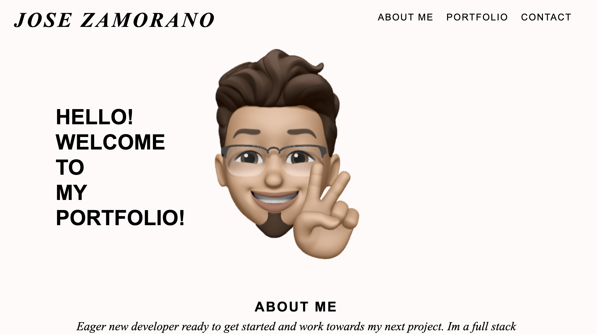
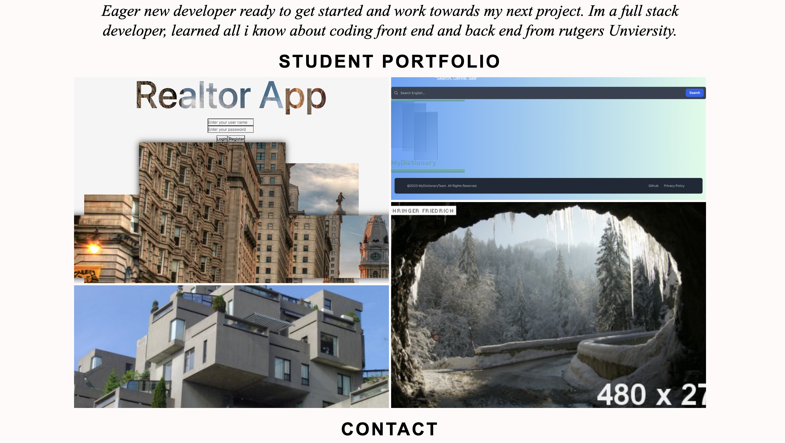

# Zamos_Protfolio

## Description

For this challenge, I was tasked creating a portfolio for my web development work, using only HTML and advanced CSS (including flexbox, CSS Grid, media queries, and CSS variables).

## Acceptance Criteria

* Portfolio must include:
    * Developer's name
    * A recent photo
    * An "About Me" section
    * A portfolio/showcase of work
    * Contact info
* Links in navigation must scroll to corresponding section
* Primary portfolio image must be larger than others
* Portfolio images link to deployed applications/projects
* Site is responsive on various screens and devices

## Website Link
https://jzamorano20.github.io/Zamos_Protfolio/

## Screenshots

